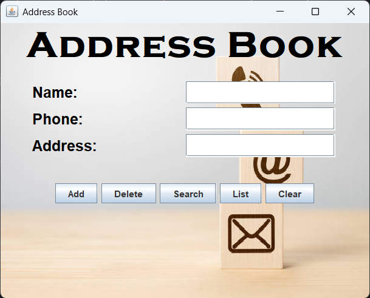
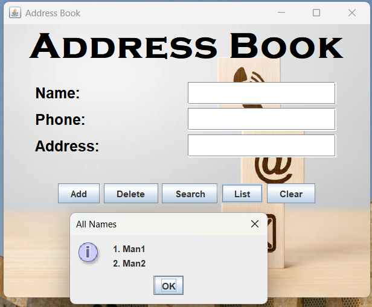

# Address Book

## 📝 Summary
This is a simple Java-based Address Book application with a graphical user interface (GUI). It allows users to add, delete, search, list, and clear people in an address book. The interface includes a background image, providing a more visually appealing user experience.

## ⭐ Features
- **Add Person**: Adds a new person with their name, phone, and address.
- **Delete Person**: Removes a person from the address book by their name.
- **Search Person**: Finds and shows the details of a person by their name.
- **List All People**: Displays a list of all the people in the address book.
- **Clear Fields**: Clears the input fields after any operation.

## 🛠️ Technology Used
- **Java**: The core programming language used to build the application.
- **Swing**: Java Swing is used to build the graphical user interface (GUI).
- **BufferedImage & ImageIO**: Used to display a background image.

## 🖼️ Interface

|  |  |
| ------------------------------------------------- | ---------------------------------------------------- |

## 👩‍🎓 Author
- **Name**: Lutfun Nahar Barsha
- **GitHub**: https://github.com/Ctrl-LNB
- **Institute**: Uttara University (BSCSE)

